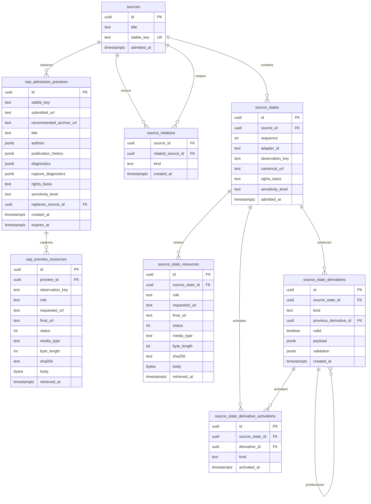

# Source Schema ER Diagram

## Invariants

- Source states, retained resources, Derivatives, relations, and activation history are append-only.
- Derivative lineage stays within the same Source state and kind.
- Activations reference only valid Derivatives from the same Source state and kind.
- Preview resources are deleted with their admission preview.
- Retained resource bodies must match their declared byte length and SHA-256 hash.
